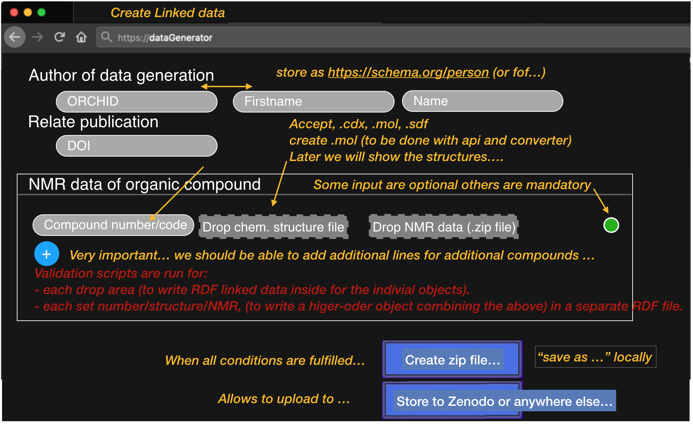
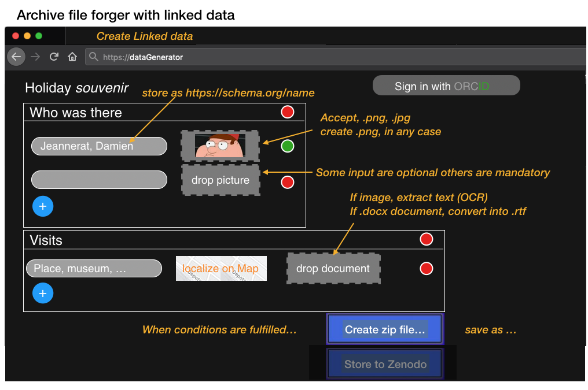

# Archive-Forge

An ORD Hackathon 2021 project based on [Challenge #5](https://github.com/ORD-Hackathon/hackathon-2021/issues/5). This code packages data according to [Frictionless Data](https://frictionlessdata.io/specs/data-package/) specifications interactively in the web browser and in the console.

This is currently a prototype in three parts:

- A set of wireframes and templates for a data publishing application, in the `images` and `templates` folders, respectively.
- A frontend application based on this concept, that runs in the Web browser - see the `app` folder.
- A backend script which illustrates the technology and conversion and packaging process, in the root folder.

See [Development setup](#development-setup) below for deployment instructions.

# Introduction

This project challenge is aimed at supporting researchers from the domain of chemical science, however our prototype is designed to be useful to the wider scientific community, making it possible to create Archive Forges for different fields of endeavour and user audiences.

Example of principle users of the Archive Forge:

- Principal investigator of a research group, who uses the tool share consistent and homogeneous data with students and faculty.
- Scientific journal editor asking authors to submit supplementary information and complementary data.

Our initial goal is to propose a web application that should make it obvious what is desired for production of a Data Package.

Based on wireframes that were elaborated during the hackathon, we have prototyped a front-end application using [Vue.js](https://vuejs.org/) and Javascript, and a back-end process using [DataFlows](https://github.com/datahq/dataflows/) in Python.

Wireframes of the UI are below:

**Chemistry-relevant example**

**General demo example**

# Development setup

Scroll down for details on running the Python-based backend.

## Frontend

Install [Node.js](https://nodejs.org/en/) > 12 and run, in the **app** folder:

`npm install`

Then:

`npm run serve`

To start a development server.

## Backend

Install [RDKit](http://www.rdkit.org/docs/Install.html#fedora-centos-and-rhel) and Python > 3.6

To install Python libraries, run:

`pip install dataflows`

Alternatively, we have set up an Anaconda environment which helps to ease cross-platform issues:

1. Install [Anaconda](http://anaconda.org)
2. Set up the *archive-forge* environment: `conda env create -f environment.yml`
3. Activate the environment: `conda activate archive-forge`

Once your environment is ready, you can run the data integration script:

`python flow.py`

An example REST server is provided for integration with the frontend, which we leave as an exercise for the reader:

`python server.py`

# License

[MIT License](LICENSE)
